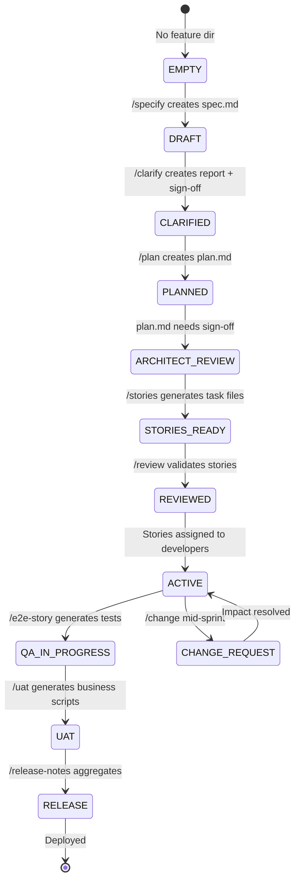

# SFSpeckit Studio — Enterprise Technical Blueprint v2.0

> **Local Desktop IDE for Salesforce Business & QA Engineering**
> Think: "Cursor IDE meets Jira meets Provar — delivered as a local web app."

---

## 1. Product Vision

A **local web application** where non-technical TPOs and QA Testers:
1. Run `npm run studio` (or double-click a desktop shortcut via Electron)
2. Connect their Salesforce org (via `sf` CLI OAuth — one click)
3. Perform their entire job through a premium visual UI with AI chat assistance
4. Commit their work back to Git without ever opening a terminal

**No Cursor IDE. No terminal commands. No raw markdown editing. No individual API keys.**

---

## 2. Architecture Overview

```
┌──────────────────────────────────────────────────────────┐
│                    QA / TPO Browser                      │
│              http://localhost:3000/studio                 │
│  ┌──────────────┐  ┌──────────────┐  ┌───────────────┐  │
│  │  TPO Mode    │  │   QA Mode    │  │  AI Chat      │  │
│  │  (Business)  │  │  (Testing)   │  │  (Shared)     │  │
│  └──────┬───────┘  └──────┬───────┘  └───────┬───────┘  │
└─────────┼─────────────────┼──────────────────┼───────────┘
          │ REST/WebSocket  │                  │
┌─────────▼─────────────────▼──────────────────▼───────────┐
│              Studio Backend (Node.js/Express)             │
│  ┌─────────────┐ ┌──────────────┐ ┌────────────────────┐ │
│  │ Orchestrator │ │ Git Provider │ │ Gateway Client     │ │
│  │ (CLI Bridge) │ │ (git cmds)   │ │ (AI Proxy)         │ │
│  └──────┬──────┘ └──────┬───────┘ └────────┬───────────┘ │
│         │               │                  │             │
│  ┌──────▼──────┐ ┌──────▼───────┐ ┌────────▼───────────┐ │
│  │ SF CLI (sf) │ │ Local .git/  │ │ Corporate Gateway  │ │
│  │ Playwright  │ │              │ │ (holds master key)  │ │
│  └──────┬──────┘ └──────────────┘ └────────────────────┘ │
└─────────┼────────────────────────────────────────────────┘
          │
┌─────────▼────────────────────────────────────────────────┐
│              Salesforce Org (Sandbox/Prod)                │
└──────────────────────────────────────────────────────────┘
```

---

## 3. The "Brains": Complete Skill-to-UI Mapping

The Studio **does not rewrite** skill logic. It reads each `SKILL.md` as the system prompt, gathers the user's input via forms/chat, and sends both to the AI Gateway for execution.

### 3A. TPO Mode Skills

| # | UI Screen | Skill Invoked | Who | Input (from UI) | Output (to filesystem) |
|---|-----------|--------------|-----|-----------------|----------------------|
| 1 | **Setup Wizard** | `sfspeckit-constitution` | TPO | Project name, team size, org type | `sfspeckit-data/memory/constitution.md` |
| 2 | **Feature Creator** | `sfspeckit-specify` | TPO | Feature name, personas, requirements form | `sfspeckit-data/specs/NNN/spec.md` |
| 3 | **Clarification Center** | `sfspeckit-clarify` | TPO | Answers to gap-analysis questions | `sfspeckit-data/specs/NNN/clarification-report.md` |
| 4 | **Architecture Viewer** | `sfspeckit-plan` | TPO | Tech stack preferences | `sfspeckit-data/specs/NNN/plan.md` + `data-model.md` |
| 5 | **Story Board** | `sfspeckit-stories` | TPO | Approval confirmation | `sfspeckit-data/specs/NNN/task_story_*.md` |
| 6 | **Review Gate** | `sfspeckit-review` | TPO+Arch | Checklist sign-offs | Updated story statuses |
| 7 | **Change Request** | `sfspeckit-change` | TPO | Change description | Impact report + updated stories |
| 8 | **Release Notes** | `sfspeckit-release-notes` | TPO | Feature selection | `RELEASE_NOTES.md` |

### 3B. QA Mode Skills

| # | UI Screen | Skill Invoked | Who | Input (from UI) | Output (to filesystem) |
|---|-----------|--------------|-----|-----------------|----------------------|
| 1 | **Story Test Generator** | `sfspeckit-e2e-story` | QA | Story file selection | `tests/stories/*.test.json` |
| 2 | **Baseline Scanner** | `sfspeckit-e2e-baseline` | QA | Object/domain scope | `tests/baseline/*.test.json` |
| 3 | **Regression Runner** | `sfspeckit-e2e-regression` | QA | Test suite selection | `RCA_Report.xlsx` |
| 4 | **UI Discovery** | `sfspeckit-e2e-discover` | QA | Page URL or description | Updated `selectors.ts` |
| 5 | **QA Verification** | `sfspeckit-qa` | QA | Story file selection | `task_story_NN_test_scripts.md` |
| 6 | **UAT Scripts** | `sfspeckit-uat` | BPO | Story file selection | `uat_story_NN.md` |
| 7 | **Quality Dashboard** | `sfspeckit-score` | QA/Arch | Feature selection | Quality scoring report |

---

## 4. Enterprise AI Gateway

### Why a Gateway?
Individual API keys are a security and management risk. The Gateway provides a single, centralized, enterprise-controlled LLM endpoint.

### Gateway Architecture
```
Studio (Local)                    Corporate Network
┌─────────────┐     HTTPS        ┌──────────────────────┐
│ gateway.js  │ ──────────────►  │  AI Gateway Proxy    │
│             │                  │  (Express/Vercel)    │
│ Sends:      │                  │                      │
│ - skill.md  │                  │  Attaches:           │
│ - user msg  │                  │  - Master API Key    │
│ - context   │                  │  - Rate Limits       │
│             │  ◄────────────── │  - Usage Logging     │
│ Receives:   │     Response     │  - Cost Tracking     │
│ - AI output │                  │                      │
└─────────────┘                  │  Forwards to:        │
                                 │  OpenAI / Anthropic  │
                                 │  / Azure OpenAI      │
                                 └──────────────────────┘
```

### Gateway Configuration (Studio Side)
```env
# studio/.env (shipped with the repo — no secrets here)
GATEWAY_URL=https://ai-gateway.yourcompany.com/v1/chat
GATEWAY_AUTH=SSO  # or HEADER_TOKEN
```

### Gateway Features
- **Cost Tracking**: Logs token usage per user/session for billing
- **Rate Limiting**: Prevents runaway usage (e.g., 100 requests/user/hour)
- **Model Routing**: Gateway decides which model to use (Flash for simple, Pro for complex)
- **Audit Trail**: Every prompt/response logged for compliance
- **Key Rotation**: Master key rotated without touching any local machines

---

## 5. Salesforce Org Connection

### Method: `sf org login web` (OAuth via Browser)
```
User clicks "Connect Org"
    → Studio backend runs: sf org login web --set-default-org
    → Browser opens Salesforce login page (standard OAuth)
    → User logs in normally
    → sf CLI stores the auth token locally (~/.sf/)
    → Studio reads org info: sf org display --json
    → UI shows: "Connected to: MyCompany Sandbox (API 63.0)"
```

### Multi-Org Support
- **Org Switcher** dropdown reads from `sf org list --json`
- Users can connect multiple orgs (Dev, QA, UAT, Prod Sandbox)
- Each test run specifies `--target-org <alias>`

---

## 6. Git Integration

### UI Controls
| Button | Backend Command | Context |
|--------|----------------|---------|
| **Pull Latest** | `git pull origin <branch>` | Sync new stories from developers |
| **Create Branch** | `git checkout -b <name>` | QA starts work on a story |
| **View Changes** | `git status --porcelain` | Show modified files |
| **Commit & Push** | `git add . && git commit && git push` | Save QA's test files |
| **Switch Branch** | `git checkout <branch>` | Move between features |

### Conflict Resolution
- If `git pull` has conflicts, Studio shows a warning banner
- Lists conflicting files with "Open in Editor" links
- Simple text-based diff viewer for non-technical resolution

---

## 7. Feature Lifecycle State Machine

The Studio automatically detects the current state by scanning `sfspeckit-data/specs/NNN/`:



### State Detection Logic
| State | Detection Rule |
|-------|---------------|
| EMPTY | No `spec.md` in feature dir |
| DRAFT | `spec.md` exists, no `clarification-report.md` |
| CLARIFIED | `clarification-report.md` exists with sign-off |
| PLANNED | `plan.md` exists, no architect sign-off checkbox |
| ARCHITECT_REVIEW | `plan.md` exists with empty sign-off section |
| STORIES_READY | `task_story_*.md` files exist with DRAFT status |
| REVIEWED | All stories have READY status |
| ACTIVE | Any story has IMPLEMENTING status |
| QA_IN_PROGRESS | Any `*.test.json` or `*_e2e_results.md` exists |

---

## 8. Backend Implementation

### 8A. Server Routes

```javascript
// === TPO Mode Routes ===
POST   /api/tpo/specify          // Create new feature spec
POST   /api/tpo/clarify          // Run gap analysis
POST   /api/tpo/plan             // Generate architecture plan
POST   /api/tpo/stories          // Decompose into stories
POST   /api/tpo/review           // Validate story decomposition
POST   /api/tpo/change           // Mid-sprint change request
POST   /api/tpo/release-notes    // Generate release notes

// === QA Mode Routes ===
POST   /api/qa/e2e-story         // Generate E2E test from story
POST   /api/qa/e2e-baseline      // Scan org for baseline tests
POST   /api/qa/e2e-regression    // Run full regression suite
POST   /api/qa/e2e-discover      // UI discovery & selector heal
POST   /api/qa/verify            // Run QA verification
POST   /api/qa/uat               // Generate UAT scripts
POST   /api/qa/score             // Quality scoring dashboard

// === Shared Routes ===
POST   /api/chat                 // AI chat (gateway proxy)
GET    /api/features             // List all features
GET    /api/features/:id/state   // Get feature lifecycle state
POST   /api/git/pull             // Git pull
POST   /api/git/commit           // Git commit & push
GET    /api/git/status           // Git status
GET    /api/orgs                 // List connected SF orgs
POST   /api/orgs/connect         // Trigger sf org login web
GET    /api/orgs/:alias/info     // Get org metadata

// === Live Streaming ===
WS     /ws/logs                  // WebSocket for live CLI output
WS     /ws/test-runner           // WebSocket for Playwright stream
```

### 8B. Core Backend Modules

#### `server/orchestrator.js` — CLI Bridge
```javascript
// Spawns CLI commands and streams output via WebSocket
// Used for: sf commands, git commands, npx playwright
// Key features:
//   - child_process.spawn with live stdout/stderr streaming
//   - Process lifecycle management (start, cancel, timeout)
//   - Output buffering for the UI terminal component
```

#### `server/gateway.js` — Enterprise AI Client
```javascript
// Communicates with the corporate AI Gateway
// Key features:
//   - Reads SKILL.md content as system prompt
//   - Attaches relevant file context (spec.md, plan.md, etc.)
//   - Streams AI responses back to the UI via SSE
//   - Logs every interaction to studio/logs/ for audit
//   - Retries with exponential backoff on gateway errors
```

#### `server/file-watcher.js` — Filesystem Monitor
```javascript
// Watches sfspeckit-data/ and tests/ for changes
// Key features:
//   - Uses chokidar for cross-platform file watching
//   - Emits WebSocket events when files change
//   - UI auto-refreshes when a story status changes
//   - Detects new files (e.g., developer pushed a new story)
```

#### `server/state-engine.js` — Feature State Calculator
```javascript
// Scans sfspeckit-data/specs/NNN/ and determines lifecycle state
// Key features:
//   - Reads file existence and content markers
//   - Detects architect sign-off checkboxes in plan.md
//   - Detects story statuses across all task_story_*.md files
//   - Returns the canonical state for the UI status badge
```

#### `server/sf-provider.js` — Salesforce CLI Wrapper
```javascript
// Wraps sf CLI commands with JSON parsing
// Key features:
//   - sf org list --json → parsed org list
//   - sf org display --json → org info
//   - sf org login web → OAuth trigger
//   - sf apex run test → test execution
//   - sf data query → SOQL queries
```

#### `server/git-provider.js` — Git CLI Wrapper
```javascript
// Wraps git commands for the UI
// Key features:
//   - git status --porcelain → changed file list
//   - git pull / push / commit → sync operations
//   - git branch --list → branch list
//   - git log --oneline -10 → recent history
//   - Conflict detection and reporting
```

---

## 9. Frontend UI Design

### 9A. Global Layout
```
┌─────────────────────────────────────────────────────────┐
│ ◉ SFSpeckit Studio          [TPO ◉ | ○ QA]   [⚙ Settings] │
├────────────┬────────────────────────────┬───────────────┤
│            │                            │               │
│  Sidebar   │     Main Content Area      │   AI Chat     │
│            │                            │   Panel       │
│ • Features │  (Changes based on mode    │               │
│ • Stories  │   and selected screen)     │  💬 Ask me    │
│ • Tests    │                            │   anything... │
│ • Orgs     │                            │               │
│ • Git      │                            │               │
│            │                            │               │
├────────────┴────────────────────────────┴───────────────┤
│ Terminal Output (collapsible)                    [▾ Hide]│
│ $ sf org display --json                                 │
│ { "status": 0, "result": { ... } }                     │
└─────────────────────────────────────────────────────────┘
```

### 9B. TPO Mode Screens

**Screen 1: Feature Dashboard**
- Card grid of all features with lifecycle status badges
- "New Feature" button → opens the Specify wizard
- Click a feature → opens its detail view

**Screen 2: Specification Wizard** (`/specify`)
- Multi-step form: Feature Name → Personas → User Stories → Requirements
- AI Chat can assist: "Help me write user stories for invoice management"
- Generates `spec.md` on completion

**Screen 3: Clarification Center** (`/clarify`)
- Card-based Q&A interface
- Each `[NEEDS CLARIFICATION]` marker → interactive card
- TPO types answers → AI updates the spec
- Org Drift Alert section (from CLI scan)

**Screen 4: Architecture Viewer** (`/plan`)
- Mermaid.js ERD diagram of the data model
- Deployment order timeline
- **Architect Sign-Off Gate**: Digital checkbox with name/date
- Impact Analysis matrix (blast radius)

**Screen 5: Story Board** (`/stories`)
- Kanban-style board: DRAFT → READY → IMPLEMENTING → QA → DONE
- Dependency graph visualization
- Click a story → detail panel with effort estimates

**Screen 6: Change Request** (`/change`)
- Text input for change description
- AI generates impact report
- Shows affected stories with color-coded severity
- Approve/Reject actions

**Screen 7: Release Notes** (`/release-notes`)
- One-click generation from completed stories
- Preview panel with formatted release notes
- Export as PDF or Markdown

### 9C. QA Mode Screens

**Screen 1: Test Dashboard**
- Overview: Total tests, pass rate, last run
- Quick actions: "Generate Test", "Run All", "View Reports"
- Recent test runs with pass/fail badges

**Screen 2: Story Test Generator** (`/e2e-story`)
- Story file selector (from Git)
- "Generate E2E Test" button
- Preview of generated `.test.json` in visual step format
- "Run Test" button with live streaming

**Screen 3: Visual Test Editor**
- Drag-and-drop step timeline
- Dropdowns for actions (click, fill, assert, selectPicklist, etc.)
- Real-time JSON preview panel
- Schema validation indicators

**Screen 4: Live Test Runner**
- Persona selector (Admin, Sales Rep, etc.)
- Real-time progress bar per test step
- Screenshot capture on each step
- Live terminal output stream

**Screen 5: RCA Triage Dashboard**
- Failed tests with screenshots
- AI-powered root cause explanation
- "Auto-Fix" button → AI proposes JSON fix
- 12-category RCA classification

**Screen 6: Quality Scoring** (`/score`)
- Feature-level quality dashboard
- Per-story breakdown (Metadata/Apex/LWC/Testing scores)
- Code coverage summary
- "Top Improvements Needed" recommendations

---

## 10. Technology Stack

| Layer | Technology | Rationale |
|-------|-----------|-----------|
| **Frontend** | React 19 + Vite | Fast dev, modern hooks |
| **Styling** | Vanilla CSS (Dark Mode) | Premium feel, no framework lock-in |
| **Icons** | Lucide React | Clean, consistent iconography |
| **Diagrams** | Mermaid.js | ERD, dependency graphs, state machines |
| **Backend** | Node.js + Express | Simple, cross-platform, native CLI access |
| **Real-time** | Socket.io (WebSocket) | Live log streaming, file change notifications |
| **AI** | Corporate Gateway Client | Zero local keys, centralized billing |
| **File Watching** | Chokidar | Cross-platform filesystem monitoring |
| **Desktop (Optional)** | Electron | Package as `.exe` / `.dmg` if needed |

---

## 11. Directory Structure

```text
SFSpeckit/
├── .agents/skills/              ← The "Brains" (44 skill definitions)
│   ├── sfspeckit-specify/       ← TPO: Create specs
│   ├── sfspeckit-clarify/       ← TPO: Gap analysis
│   ├── sfspeckit-plan/          ← TPO: Architecture
│   ├── sfspeckit-stories/       ← TPO: Story decomposition
│   ├── sfspeckit-review/        ← TPO+Arch: Story validation
│   ├── sfspeckit-change/        ← TPO: Mid-sprint changes
│   ├── sfspeckit-release-notes/ ← TPO: Release documentation
│   ├── sfspeckit-e2e-story/     ← QA: Story test generation
│   ├── sfspeckit-e2e-baseline/  ← QA: Org baseline scanning
│   ├── sfspeckit-e2e-regression/← QA: Full regression runs
│   ├── sfspeckit-e2e-discover/  ← QA: UI discovery & healing
│   ├── sfspeckit-qa/            ← QA: Technical verification
│   ├── sfspeckit-uat/           ← BPO: Business acceptance
│   ├── sfspeckit-score/         ← QA/Arch: Quality scoring
│   └── ... (30 more SF skills)
│
├── sfspeckit-data/               ← The "Memory" (TPO artifacts)
│   ├── memory/constitution.md
│   ├── specs/NNN-feature/
│   │   ├── spec.md
│   │   ├── clarification-report.md
│   │   ├── plan.md
│   │   ├── data-model.md
│   │   ├── task_story_00.md
│   │   ├── task_story_01.md
│   │   └── RELEASE_NOTES.md
│   └── templates/
│
├── tests/                        ← The "Test Suite" (QA artifacts)
│   ├── stories/*.test.json
│   ├── baseline/*.test.json
│   └── reports/RCA_Report.xlsx
│
└── studio/                       ← The "Interface" (NEW)
    ├── package.json
    ├── server/
    │   ├── index.js              ← Express server entry point
    │   ├── orchestrator.js       ← CLI execution bridge
    │   ├── gateway.js            ← Enterprise AI Gateway client
    │   ├── state-engine.js       ← Feature lifecycle state calc
    │   ├── sf-provider.js        ← Salesforce CLI wrapper
    │   ├── git-provider.js       ← Git CLI wrapper
    │   ├── file-watcher.js       ← Filesystem change monitor
    │   └── audit-logger.js       ← Compliance logging
    ├── client/
    │   ├── src/
    │   │   ├── App.jsx           ← Root with mode switcher
    │   │   ├── modes/
    │   │   │   ├── TPO/
    │   │   │   │   ├── FeatureDashboard.jsx
    │   │   │   │   ├── SpecifyWizard.jsx
    │   │   │   │   ├── ClarificationCenter.jsx
    │   │   │   │   ├── ArchitectureViewer.jsx
    │   │   │   │   ├── StoryBoard.jsx
    │   │   │   │   ├── ChangeRequest.jsx
    │   │   │   │   └── ReleaseNotes.jsx
    │   │   │   └── QA/
    │   │   │       ├── TestDashboard.jsx
    │   │   │       ├── StoryTestGenerator.jsx
    │   │   │       ├── VisualTestEditor.jsx
    │   │   │       ├── LiveTestRunner.jsx
    │   │   │       ├── RCATriage.jsx
    │   │   │       └── QualityScoring.jsx
    │   │   ├── shared/
    │   │   │   ├── AIChatPanel.jsx
    │   │   │   ├── TerminalOutput.jsx
    │   │   │   ├── OrgSwitcher.jsx
    │   │   │   ├── GitControls.jsx
    │   │   │   └── MermaidRenderer.jsx
    │   │   └── design/
    │   │       ├── tokens.css     ← Color, spacing, typography
    │   │       └── components.css ← Buttons, cards, forms
    │   └── public/
    │       └── index.html
    └── logs/                      ← Audit trail (gitignored)
```

---

## 12. Enterprise Features

### 12A. Audit Logging
Every AI interaction is logged to `studio/logs/` for compliance:
```json
{
  "timestamp": "2026-05-13T14:30:00Z",
  "user": "jsmith",
  "mode": "QA",
  "skill": "sfspeckit-e2e-story",
  "prompt_tokens": 2400,
  "completion_tokens": 1800,
  "feature": "001-invoice-mgmt",
  "action": "generate_test"
}
```

### 12B. Role-Based Access (Future)
- **TPO**: Full access to TPO Mode, read-only QA Mode
- **QA**: Full access to QA Mode, read-only TPO Mode
- **Architect**: Sign-off capabilities in both modes
- **BPO**: UAT screen access only

### 12C. MCP Integration (Phase 2)
Replace `child_process` CLI calls with direct Salesforce MCP integration using `@salesforce/cli-tools-node.js` for faster, more reliable org communication.

---

## 13. Phased Roadmap

### Phase 1: Foundation (Weeks 1–2)
- [ ] Scaffold `studio/` with Vite + Express
- [ ] Dark-mode design system (tokens, components)
- [ ] Mode switcher (TPO / QA toggle)
- [ ] Enterprise AI Gateway client
- [ ] Salesforce org connection (`sf org login web`)
- [ ] Git integration (pull, commit, push)
- [ ] Live terminal output component

### Phase 2: TPO Mode (Weeks 3–4)
- [ ] Feature Dashboard with lifecycle state badges
- [ ] Specification Wizard (form → `/specify`)
- [ ] Clarification Center (card-based Q&A)
- [ ] Architecture Viewer (Mermaid ERD + sign-off gate)
- [ ] Story Board (Kanban + dependency graph)
- [ ] Change Request screen
- [ ] Release Notes generator

### Phase 3: QA Mode (Weeks 5–6)
- [ ] Test Dashboard with pass/fail overview
- [ ] Story Test Generator (story → `.test.json`)
- [ ] Visual Test Editor (drag-and-drop steps)
- [ ] Live Test Runner (Playwright streaming)
- [ ] RCA Triage Dashboard (screenshots + AI fix)
- [ ] Quality Scoring Dashboard

### Phase 4: Polish & Enterprise (Weeks 7–8)
- [ ] AI Chat Panel (shared, context-aware sidebar)
- [ ] File watcher for real-time UI updates
- [ ] Audit logging for compliance
- [ ] Electron packaging (optional desktop app)
- [ ] Cross-platform testing (Mac + Windows)
- [ ] User documentation & onboarding guide

---

## 14. Verification Plan

| Test | Method | Success Criteria |
|------|--------|-----------------|
| **Gateway Security** | Inspect `.env` and network calls | No API keys in local code |
| **TPO Workflow** | Create spec → clarify → plan → stories | All files generated correctly |
| **QA Workflow** | Generate test → run → view RCA | Playwright executes, results stream |
| **Git Sync** | Pull → modify → commit → push | Changes visible in remote repo |
| **Org Connection** | Click "Connect" → OAuth flow | Org info displayed in UI |
| **Cross-Platform** | Run on Mac and Windows | Identical behavior |
| **State Detection** | Scan feature dir at each lifecycle stage | Correct state badge shown |
| **Audit Trail** | Run 10 AI interactions | All 10 logged in `studio/logs/` |

---

## 15. Competitive Position

| | Provar | Copado | Gearset | **SFSpeckit Studio** |
|---|---|---|---|---|
| **Delivery** | Desktop EXE | Cloud | Cloud | **Local App** |
| **Pricing** | ~$1,000/user/yr | ~$500/user/yr | ~$400/user/yr | **Free (self-hosted)** |
| **AI Generation** | ❌ | ❌ | ❌ | **✅ NL → tests** |
| **TPO Workflow** | ❌ | ❌ | ❌ | **✅ Full lifecycle** |
| **Quality Scoring** | ❌ | ❌ | ❌ | **✅ 555-point** |
| **Git-Native** | ❌ | ✅ | ✅ | **✅ Docs-as-Code** |
| **Dual Mode** | ❌ | ❌ | ❌ | **✅ TPO + QA** |
| **Enterprise AI** | ❌ | ❌ | ❌ | **✅ Gateway** |
